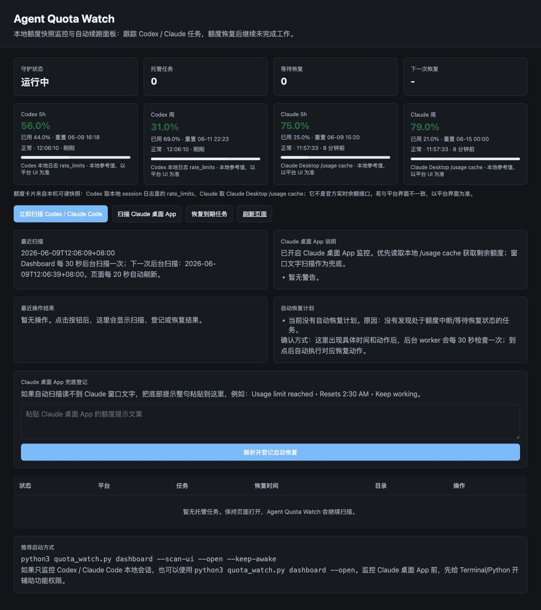

# Agent Quota Watch

Local quota snapshot monitoring and automatic resume scheduling for AI coding agents.

Agent Quota Watch helps long-running Codex, Claude Code, and Claude Desktop tasks survive quota windows. It watches local session logs and locally cached quota snapshots, records interrupted work, waits for the reset time, and resumes the task when the quota window opens again.

It is designed for people who start an agent job, hit a 5-hour quota limit, and do not want to wake up at 2:30 AM just to press continue.



## What It Does

- Monitors Codex local `rate_limits` snapshots from `~/.codex/sessions`.
- Monitors Claude Code local session logs from `~/.claude/projects`.
- Reads Claude Desktop `/usage` cache snapshots when available.
- Scans Claude Desktop visible usage-limit text as a fallback on macOS.
- Registers interrupted or near-limit tasks with reset times.
- Resumes due Codex / Claude Code tasks through public CLI resume commands.
- For Claude Desktop, sends a continuation prompt in the current chat after the reset time.
- Provides a local web dashboard at `http://127.0.0.1:8765`.
- Keeps macOS awake during unattended monitoring with `--keep-awake`.

## Important Scope

Agent Quota Watch is not an official quota API client.

Quota cards are local reference snapshots:

- Codex quota cards come from local session log `rate_limits`.
- Claude quota cards come from Claude Desktop Chromium `/usage` cache.
- These values can lag behind the UI shown by Codex, Claude, or Claude Code.
- If the platform UI disagrees with this dashboard, trust the platform UI.

The automatic resume workflow is the core feature. The quota percentages are helpful hints, not guaranteed real-time account balances.

## Quick Start

Clone the repo:

```bash
git clone https://github.com/happiness9527/agent-quota-watch.git
cd agent-quota-watch
```

Start the dashboard:

```bash
python3 quota_watch.py dashboard --scan-ui --open --keep-awake
```

Open:

```text
http://127.0.0.1:8765
```

If `quota_watch.py` is not available in your copy, the legacy entry point also works:

```bash
python3 guardian.py dashboard --scan-ui --open --keep-awake
```

## Requirements

- macOS is recommended.
- Python 3.10+.
- Codex CLI if you want Codex resume support.
- Claude Code CLI if you want Claude Code resume support.
- Claude Desktop if you want Desktop app monitoring.
- Optional but recommended for Claude Desktop quota cache:

```bash
brew install zstd
```

For Claude Desktop window scanning, grant Accessibility permission to your terminal app:

1. Open macOS System Settings.
2. Go to Privacy & Security.
3. Open Accessibility.
4. Enable Terminal, iTerm, Warp, or the app that launches Python.

## How It Works

### Codex

Agent Quota Watch scans:

```text
~/.codex/sessions
~/.codex/archived_sessions
```

When a session log contains `rate_limits`, the dashboard can show local quota snapshots and reset times. If a task is already near the configured threshold, it can be scheduled for automatic resume after reset.

Resume command shape:

```bash
codex exec resume <session-id> "<resume prompt>"
```

### Claude Code

Agent Quota Watch scans:

```text
~/.claude/projects/**/*.jsonl
```

It looks for usage-limit signals such as `Usage limit reached`, `rate limited`, `retry after`, or related quota text. When it finds an interrupted session, it records the task and reset time.

Resume command shape:

```bash
claude -p --continue "<resume prompt>"
```

or:

```bash
claude -p --resume <session-id> "<resume prompt>"
```

### Claude Desktop

Agent Quota Watch uses two local-only sources:

- Claude Desktop `/usage` cache for quota snapshot cards.
- macOS Accessibility text scanning for visible usage-limit banners.

Claude Desktop's `Keep working` button is not treated as a resume button. It is an upgrade / extra-usage conversion entry. After the reset time, Agent Quota Watch refreshes the app and sends a continuation prompt in the current chat:

```text
请继续完成刚才因为额度限制中断的任务。请先简要回顾上一步已经完成到哪里，然后直接继续完成剩余工作。
```

## Common Commands

Start the dashboard:

```bash
python3 quota_watch.py dashboard --scan-ui --open --keep-awake
```

Scan once:

```bash
python3 quota_watch.py discover --scan-ui
```

List registered tasks:

```bash
python3 quota_watch.py list
```

Resume one task now:

```bash
python3 quota_watch.py resume <task-id>
```

Delete a task:

```bash
python3 quota_watch.py delete <task-id>
```

Adjust the early-warning threshold. This example schedules Claude Desktop when the local 5-hour snapshot has 15% or less remaining:

```bash
python3 quota_watch.py dashboard --scan-ui --quota-warning-remaining 15
```

Run as a terminal daemon:

```bash
python3 quota_watch.py daemon --scan-ui --interval 60
```

## Local State

By default, Agent Quota Watch writes local state to:

```text
~/.agent-quota-watch/
```

For compatibility, if the older `~/.agent-continuity/` directory already exists and `~/.agent-quota-watch/` does not, the tool will continue using the older directory.

Override the location:

```bash
AGENT_QUOTA_WATCH_HOME=/path/to/state python3 quota_watch.py dashboard
```

Project checkpoints are written inside the project directory:

```text
.agent-quota-watch/<task-id>.md
```

## Safety

- No account passwords are read.
- No API keys or auth files are parsed.
- No external network calls are needed for monitoring.
- Resume actions use public CLI commands or local macOS UI automation.
- Claude Desktop UI automation requires Accessibility permission.
- Local quota snapshots are treated as advisory data.

## 中文简介

Agent Quota Watch 是一个本地工具，用来监控 Codex、Claude Code、Claude Desktop 的额度中断任务，并在额度窗口恢复后自动续跑。

它适合这类场景：你让 agent 跑一个长任务，跑到一半额度没了，平台提示几个小时后重置。这个工具会记录任务、等待重置时间，并在到点后继续执行。

需要特别注意：页面里的额度百分比是本机日志或本地 cache 快照，不是官方实时余额接口。如果它和平台界面显示不同，以平台界面为准。

## Roadmap

- Better Claude Desktop visible UI parsing.
- Optional menu bar app.
- More agent platforms.
- Safer cross-device task state sync.
- Packaged macOS installer.

## License

MIT
